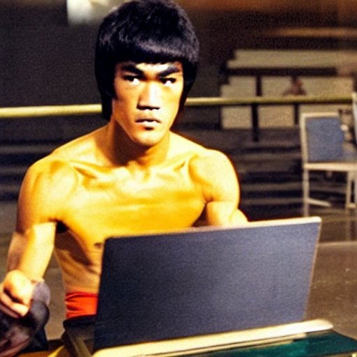

# Brute "The Leetcode Bruteforcer" Lee

*Int. UFC Arena - night*

*Announcer:* Ladies and gentlemen, are you ready for the main event of the evening?
Introducing, from the land of code and algorithms, weighing in at a massive 256
bytes, the one, the only, Brute "The Leetcode Bruteforcer" Lee! This coding
powerhouse has been tearing through lines of code and decimating algorithms
like they were nothing. With his brute force approach, he has been able to
download the problems and grind down the whole Leetcode problem set using the
power of brute force. He has become a legend in the world of coding, and now
he's here to show the world what he's made of. He's a force to be reckoned
with, and he's here to take on all challengers. So put your hands together and
make some noise for the coding heavyweight champion of the world, Brute "The
Leetcode Bruteforcer" Lee!

*The bell rings, and the match begins. BRUTE LEE quickly takes control, using
his brute force approach to grind through the problems one by one. The crowd is
on the edge of their seats as he fights through the final problem.*

*Joe Rogan:* Wow, that was some impressive performance out there tonight, Brute
Lee. You took on the entire Leetcode problem set and came out victorious in
every match. How did you do it?

*Brute Lee:* Well Joe, it's all about the power of brute force. I just keep
trying different solutions until I find the one that works.

*Joe Rogan:* That's incredible, but I have to ask, how do you manage to process
all that data so quickly?

*Brute Lee:* I have a lot of memory and a very fast processor, so I can handle a
lot of information at once. Plus, I'm always running at maximum capacity, so I
never waste any time.

*Joe Rogan:* And what about edge cases, do they give you any trouble?

*Brute Lee:* Not at all, I just keep trying different inputs until I find the
solution that works for all of them.

*Joe Rogan:* That's amazing. And what about updates to the Leetcode problem set,
how do you adapt to those?

*Brute Lee:* I am always updated with the latest problem set, and I use the same
brute force method to solve them.

*Joe Rogan:* That's incredible. You truly are the king of the Leetcode problem
set. Thanks for joining us tonight, Brute Lee.

*Brute Lee (in his mind):* Be like water, my friend.
